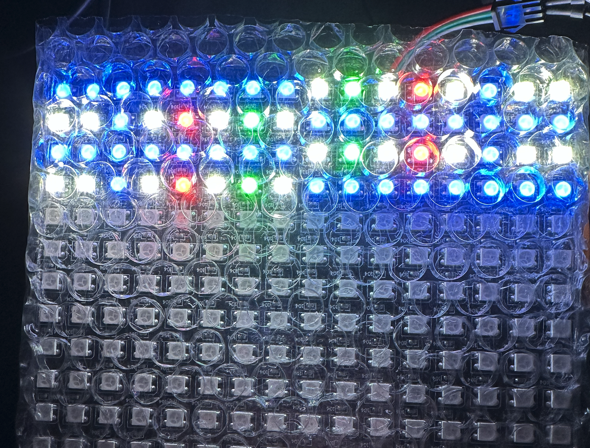
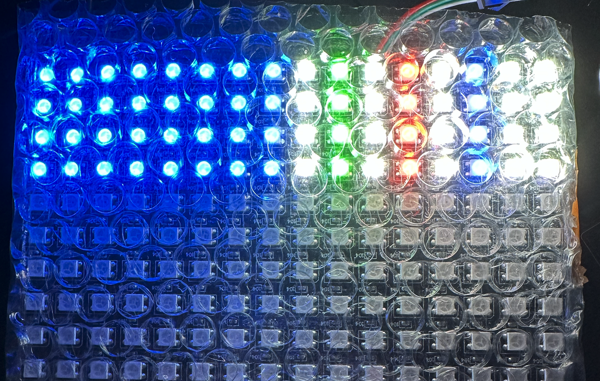

## WS2812B Driver

WS2812B is a intelligent control LED light source that the control circuit and RGB chip are integrated in a package of 5050 components. You The data transfer protocol use single **NZR** communication mode. This driver is written in [Lucid](https://alchitry.com/lucid) and is meant to be run on [Alchitry Au](https://www.sparkfun.com/products/16527) Boards + [Alchitry Br](https://www.sparkfun.com/products/16524) prototype element board.

## RAM Usage

Checkout the matrix-ram branch for implementation with RAM.

## ROM Usage

Checkout the matrix-rom branch for implementation with ROM. We use 8x8 WS281B led matrix as test case, and 8 entries of ROM automatically cycled through per ~1.7 seconds.

## Demo

Upon compilation, connect the `DIN` pin of WS2812B to Br pin `c40`, as defined in the constraint file:

```
pin outled c40;
```

You should observe **8** LEDs in the strip lit up in the following color. If your strip is just of length `N`, then you shall see only the first `N` colors.

It is initialised to:

```
  dff led_encoding[PIXEL_COUNT*$clog2(ENCODING_AMOUNT)](.clk(clk), .rst(rst), #INIT(ROW_DIMENSIONx{16hABCD}));
```

The color we will get is:

```
ABCD: 1010 1011 1100 1101

(start of connector) RED WHITE GREEN WHITE WHITE BLUE BLUE BLUE (end of strip)
```

This is due to this encoding:

```
  // WHITE (11), BLUE (10), RED (01), GREEN (00)
  const LEDCOLOR = {24hFFFFFF, 24hFF0000, 24h00FF00, 24h0000FF};
```

You can use `io_dip[1:0]` to **color encode** 8 pixels and then by pressing `io_button[0]` (up button) on io shield to **register** and see the effect on the LED strip. For instance, if your dip switches is put as follows (left to right):

```
01011010 00001100
```

The value of `io_dip[1:0]` will be concatenated to form 16 bit input (you can see this at `au_top`):

```
temp_encoding.d = ROW_DIEMSNIONx{c{io_dip[1], io_dip[0]}};
```

For instance, the above setup yields the following to be loaded to the LED strip:

```
01011010 00001100
```

It will light up the LED in this color:

```
  (start of connector) GREEN WHITE GREEN GREEN BLUE BLUE RED RED (end of strip)
```

We basically segments the color encoding as dictated by `io_dip` in groups of two bits, e.g:

```
11 11 00 00 11 11 00 00 01 01 10 10 00 00 11 00
```

and each encoding corresponds to 24-bit color, pumped from **right** to **left**, group by group (2bit ---> 24bit) at a time.

### Connect to WS2812B matrix

A matrix is essentially a long strip with reversed index every other odd row, something like this for a 16 by 16.

```
15 14 13 12 11 10 9 8 7 6 5 4 3 2 1 0
16 17 18 19 20 21 22 23 24 25 26 27 28 29 30 31
47 46 45 44 43 42 41 40 39 38 37 36 35 34 33 32
...
```

Hence we shall reverse the physical index accordingly every other row. This can be found at `reverser.luc`:

```
// check odd or even row multiple of COLUMN_DIMENSION
    if (original_pixel_address[COLUMN_DIMENSION_BITS]){
      // flip
      // we are at odd row multiple
      reversed_pixel_address = original_pixel_address ^ c{HIGHER_BITSx{b0},COLUMN_DIMENSION_BITSx{b1}}; // higher bits stays the same
    }
    else{
      reversed_pixel_address = original_pixel_address;
    }


```

Then decide whether we reverse the original addresses or not (activated or not activated):

```
    if (activate){ // if we decide to flip the leftmost bit, we reverse every other row
      // reverse every other row
      effective_pixel_address = reversed_pixel_address * 2;
    }
    else{
      // don't reverse every other row
      effective_pixel_address = original_pixel_address * 2;
    }
```

And then finally in `au_top`, we simply use it and find the encoded bits as usual:

```
    // connect reverser to led_strip
    index_reverser.original_pixel_address = led_strip.pixel_address;
    index_reverser.activate = matrix_used.q;
    encoded_pixel_address = index_reverser.effective_pixel_address * $clog2(ENCODING_AMOUNT);

    // led_strip.pixel_address will vary between 0000 to 1100
    // address 0 --> encoding bit 1:0
    // address 1 --> encoding bit 3:2
    // address 2 --> encoding bit 5
    // address N --> encoding bit N*2+1:N*2


   // get current color encoding for this pixel
    for (index=0; index<$clog2(ENCODING_AMOUNT); index++){
       current_color_encoding[index] = led_encoding.q[encoded_pixel_address+index];
    }

    // based on the encoding extracted from dff led_encoding, we get the 24bit color value
    led_strip.color = LEDCOLOR[current_color_encoding];
    outled=led_strip.led;
```

To witness this, load the binary to a WS2812B LED matrix and press `io_button[1]`, then **refresh** with `io_button[0]`. You should see all the color displayed from "left to right" instead of snaking around.

Before:


After:


## Usage

The file `ws2812b_writer.luc` receives 24 bit color input, and 1 bit signal `update` to refresh the LEDs or leave this LED strip alone and display the previous value. Each color is encoded in 24bits of data. WS2812B expects the first 8 bits sent to be G, then R (next 8), then B (following next 8).

It also receives a `clear` signal to "OFF" all LEDs regardless of `update`. If **both** update and clear is 1, then **clear** will take priority.

<span style="color:red; font-weight: bold;">Note that each of the "bit" in the 24 bit color input is not a regular digital bit sent per one FPGA clock cycle. It has it's own required encoding to send all these 24 "bits", which amounts to 125 FPGA clock cycle for each bit</span>. **Read** the datasheet!

It outputs `pixel_address`, which is the address of the current LED that should be receiving the 24 bit input color. It should ideally be connected to a ROM which receives `pixel_address` as address and outputs 24 bits of value for as long as `pixel_address` is set constant.

It also outputs `reset` flag, which is `1` when the writer is at the `RESET` state. When `reset == 1`, we change the `color` input to the writer so that it can display a fresh new set of value to to the LEDs.

Finally, it outputs two more helper bits:

- `next_pixel` that will be `1` for exactly 1 FPGA clock cycle if we are currently sending the **last** FPGA clock cycle of the 24-bit color.
- `done` that will be `1` for exactly 1 FPGA clock cycle if we are currently sending the **last** FPGA clock cycle of the 24-bit color of ALL pixels.
